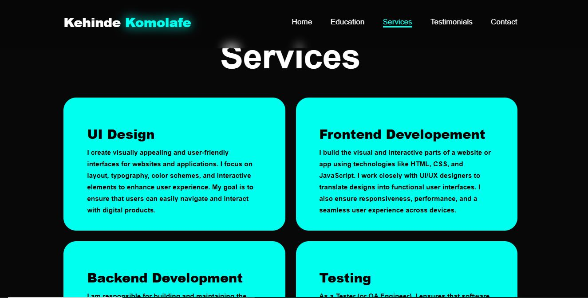
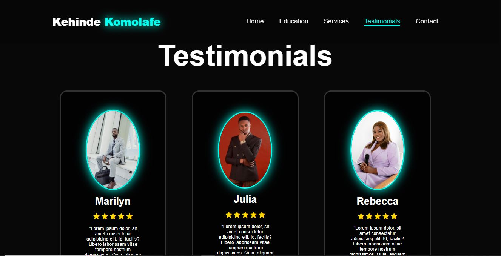

# Personal-Portfolio
This readme file gives summary of what I do, my qualification, the services I render and the testimonies of my clients.
I have a nav bar that gives the user direct access to the pages of the website.

## Home Page
This is the first page of this project, it contains my name and the discription of what I do, the social media handles and the Hire and contact botton.

## Education
This page shows my education qualification and my experience.

## Services
This page highlight the services I render:
* UI Design
* Frontend Development
* Backend Development
* Testing

## Testimonials
This page shows the testimonials of my clients.

